PicoCentrifuge - a DIY centrifuge with Raspberry Pi Pico
=======================================================
Sep 13, 2026 · Budget: $50

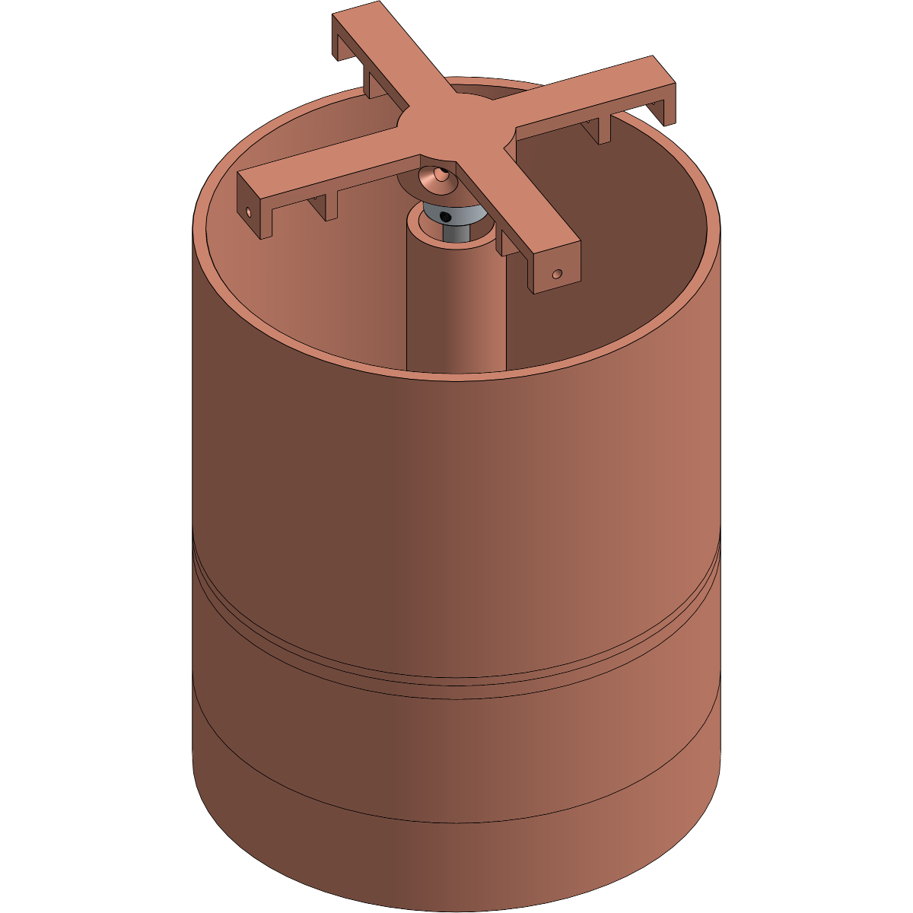

A centrifuge for blood processing. Drone motor, a Pico, and a 3D printer.

---

## Background

3 days ago was marking 13 years of my mom passing. The moment cancer took her away, I realized it's my life mission to find the definitive cure for cancer.

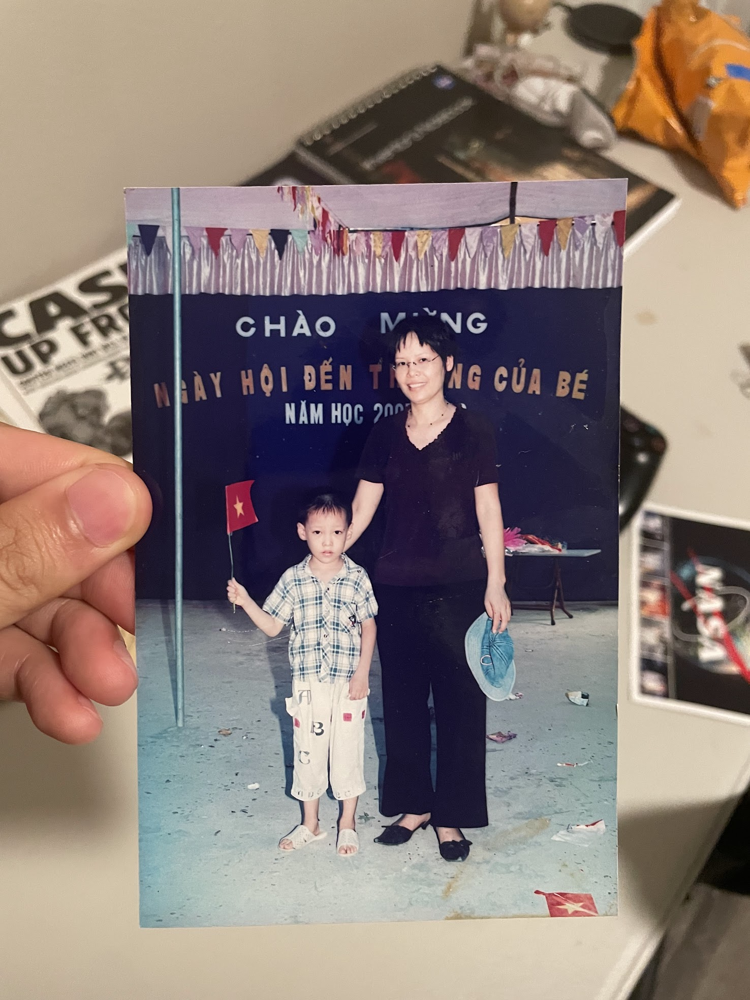

That goal has not changed. What I'm building here is a part of an experiment to create customized neoantigens to kill specific cancer cells in specific few people. 

I'm building [Bloom](https://github.com/ThomasVuNguyen/comfybloom). It takes a patient's sequencing data, finds the mutations, predicts which peptides will trigger an immune response. That part is software. Proving it works is wet lab.

The wet lab loop is simple. Show a peptide to T cells and see if they react:

- Get the T cells. Draw blood, spin it over a density gradient, pull the PBMC layer
- Keep them alive. 37°C, sterile, fed
- Introduce the peptide. Synthesized peptide + cells in a well
- Read the response. Did they secrete IFN-γ? ELISpot plate tells you

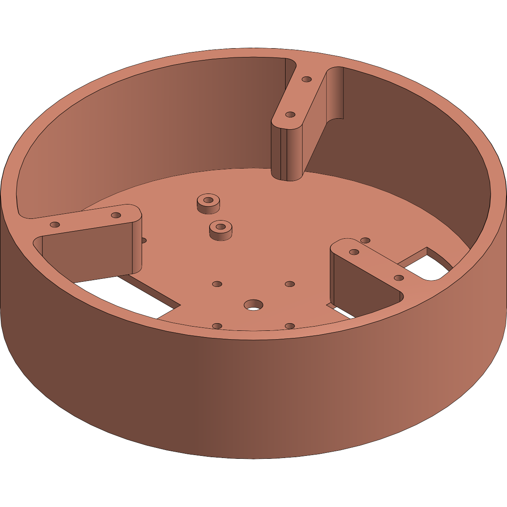

Step 1 is a centrifuge. A used lab centrifuge that fits 15 mL conical tubes goes for $800-$3,000 on eBay. That's the most expensive piece in a DIY wet lab that otherwise costs under $500 from Amazon.

I already own an A2212 brushless motor, a 30A ESC, a Raspberry Pi Pico, and a 3D printer.

The physics is simple. Spin tubes in a circle fast enough that centripetal acceleration separates blood by density. PBMC isolation over Ficoll needs about 400 × g for 30 minutes with a slow coast down.

So I'm building one.

---

## The first design that died

I gave an AI agent a task: design a swinging-bucket centrifuge for four 15 mL conicals at 400 × g. It came back with a complete package in Fusion 360. Parametric file, STEP exports, nine STLs, assembly drawing, BOM, build script. On paper it was beautiful.

On paper it also needed a containment vessel with a 466 mm clear inside diameter. That's an 18-inch restaurant stock pot. The rotor radius was 150 mm, which put the setpoint at 1,545 rpm. Reasonable for the motor, but the whole assembly was enormous. Half the bench gone.

I stared at that for a while and moved on. That design lives in `failed-iterations/BLOOM-2-fusion`. I keep dead designs around because the failure is the interesting part.

---

## What I'm actually building

I rebuilt everything from scratch in Onshape. Much more compact.

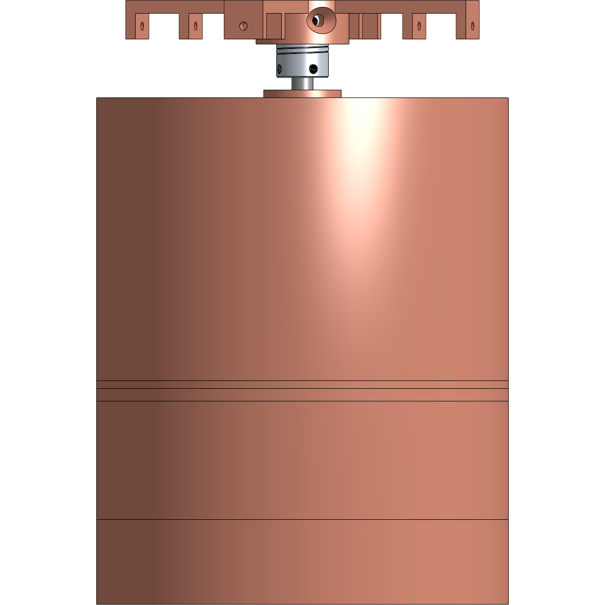

Motor sits in the base housing with the ESC. A 5-to-8 mm rigid coupler goes up to an 8 mm steel rod. Bearings in a holder. Four-arm rotor on top. Whole thing sits inside a containment pot.

Fixed-angle design instead of swinging-bucket. You get a slanted interface on a Ficoll gradient and a harder draw with the pipette. Trade-off is worth it. Mechanically simpler, shorter, easier to balance. For a first prototype, simple wins.

Here's the real thing coming together. Motor, coupler, rod, wiring, all sitting inside the printed base:

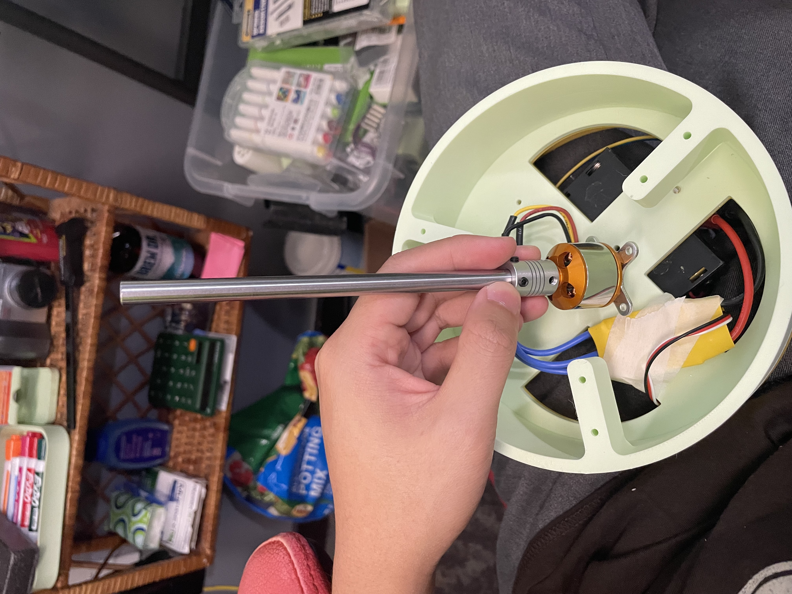

And the fully assembled unit, lid closed:

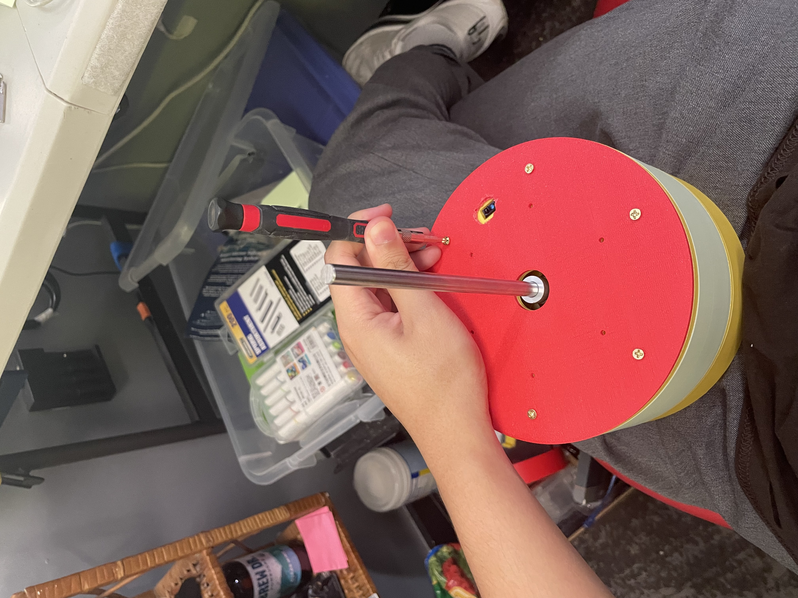

---

## The rotor

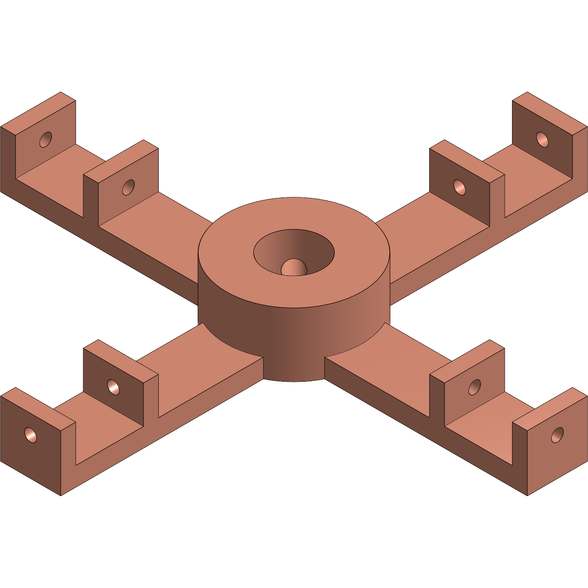

Four-arm cross, 3D printed in PETG. Each arm holds a 15 mL conical tube (17 × 120 mm). Opposing tubes need to be matched to within ±0.1 g. Imbalance at 1,500+ rpm is how you throw a tube through a wall.

The rotor radius (center of rotation to mid-fluid line) determines the RPM setpoint:

```
rpm = sqrt( RCF / (1.118e-5 × r_cm) )
```

At 400 × g, smaller radius = higher RPM. The exact number comes from measuring the real rotor off the Onshape assembly.

---

## The drivetrain

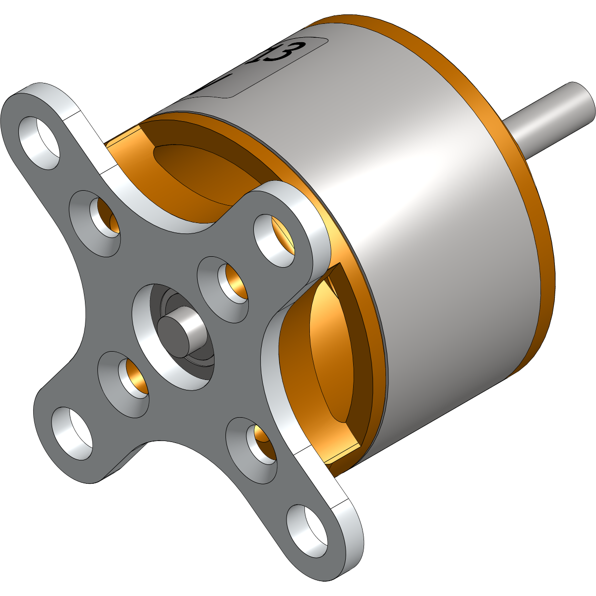

The A2212/1000KV is a drone motor. Rated for way more RPM than I need. The ESC has brake disabled and a smooth ramp programmed. You do not hard-brake a centrifuge, ever. Coast over 2 minutes minimum, or you disturb the gradient you just spent 30 minutes forming.

Here's the actual motor with the 5-to-8 mm coupler already attached. You can read "A2212/1000KV" right on the label:

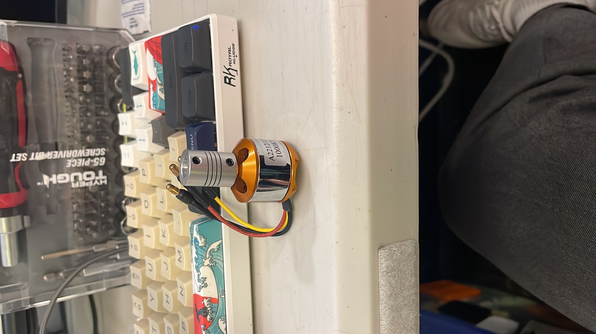

I tested the motor and ESC on the Pico before designing anything else. MicroPython ramp script, no load, no rotor. Just confirming the drivetrain works:

```python
from machine import Pin, PWM
import time

esc = PWM(Pin(1))
esc.freq(50)

def us(val):
    esc.duty_u16(int(val / 20000 * 65535))

# arm
us(1000)
time.sleep(3)

# ramp up
for throttle in range(1060, 1300, 20):
    us(throttle)
    time.sleep(2)

# ramp down
for throttle in range(1300, 1040, -20):
    us(throttle)
    time.sleep(2)

us(1000)
time.sleep(1)
esc.deinit()
```

Ran clean. The motor coils sing at higher throttle. That's normal, not an alarm.

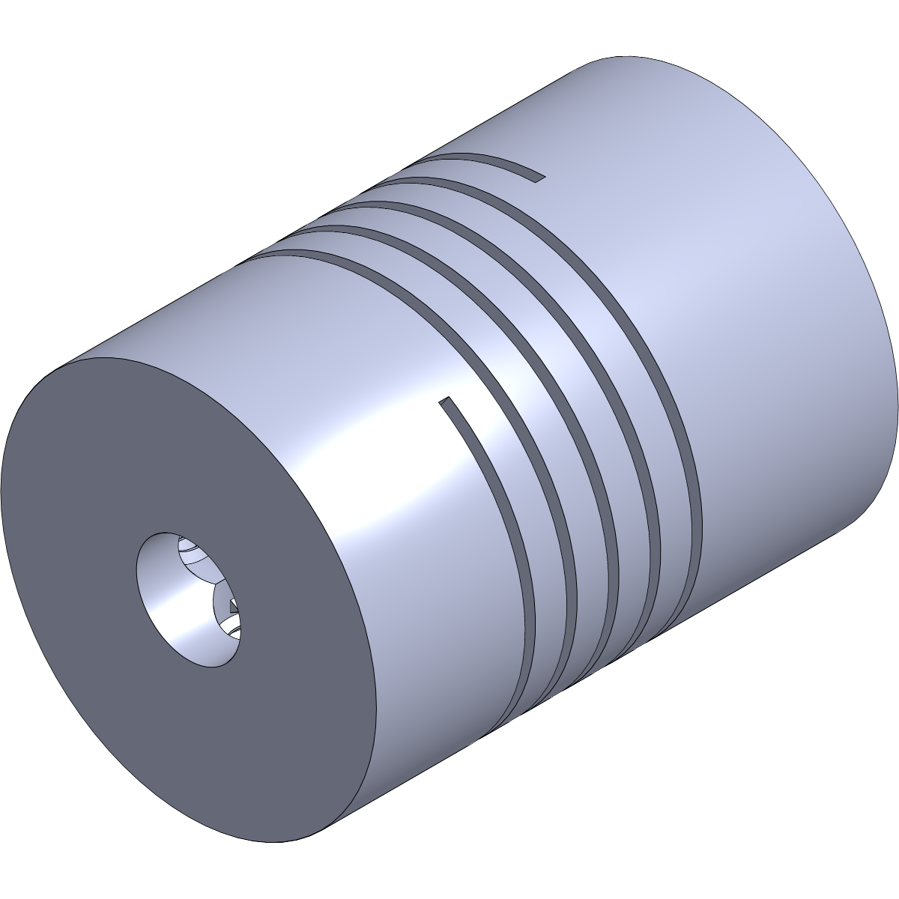

And the aluminum couplers I ordered. These are the real ones, not printed:

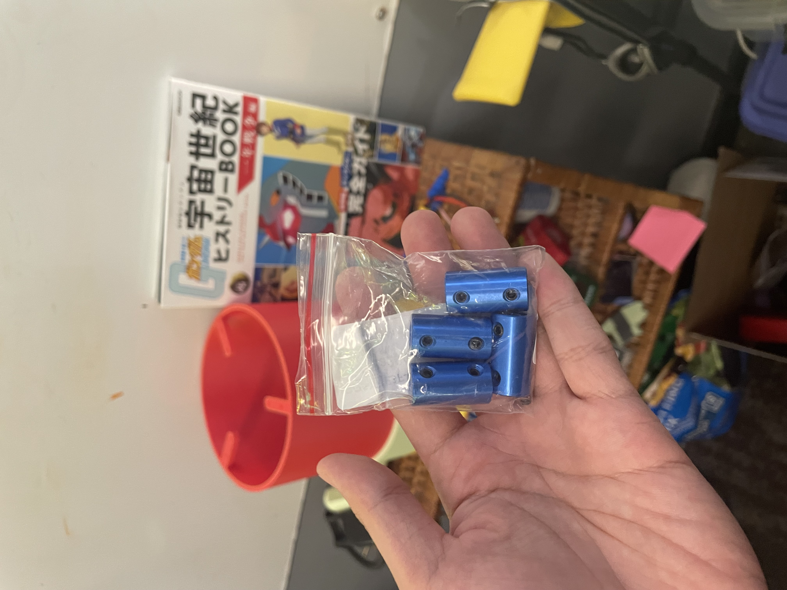

---

## Speed control

The setpoint RPM needs to be held closed-loop for 30 minutes. IR reflective sensor pointed at the underside of the rotor gives a tach signal. The Pico counts pulses and adjusts the ESC throttle to maintain target. Textbook PID loop.

---

## Safety

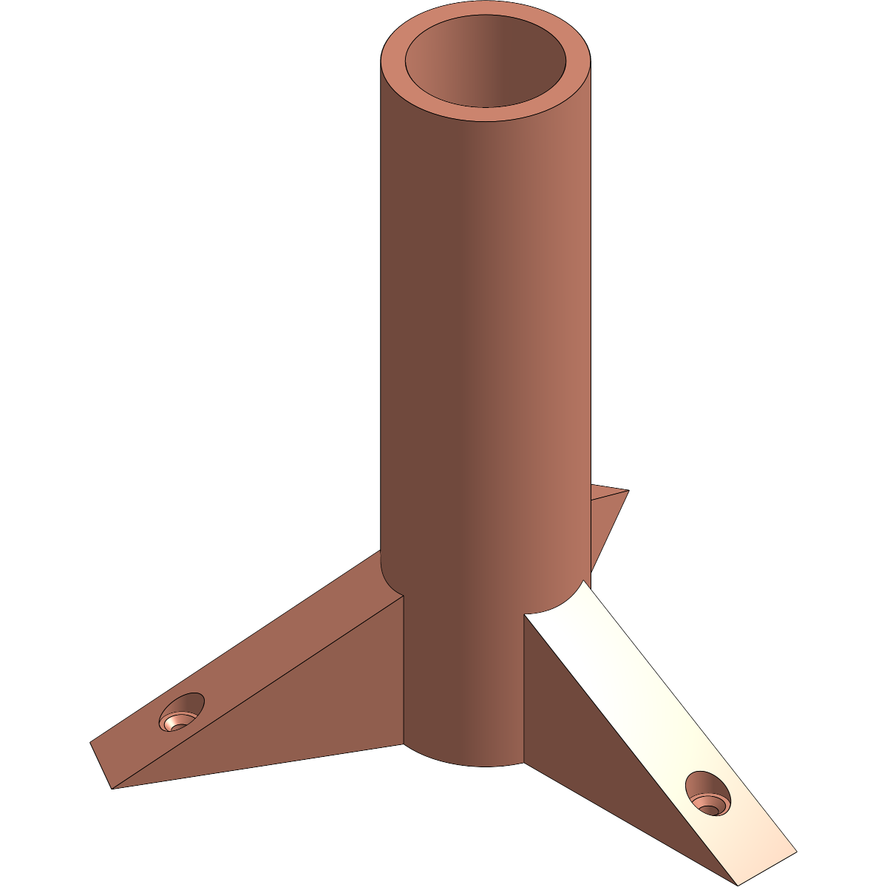

MPU-6050 accelerometer/gyro sits on the chassis. Flat, rigid, bolted near the bearing holder. NOT on the rotor. It's a vibration sensor: if something comes loose or a tube shifts, vibration signature changes and the Pico cuts motor power. Imbalance shutdown.

The whole assembly runs inside a lidded containment vessel. Lid closed for every powered test, no exceptions.

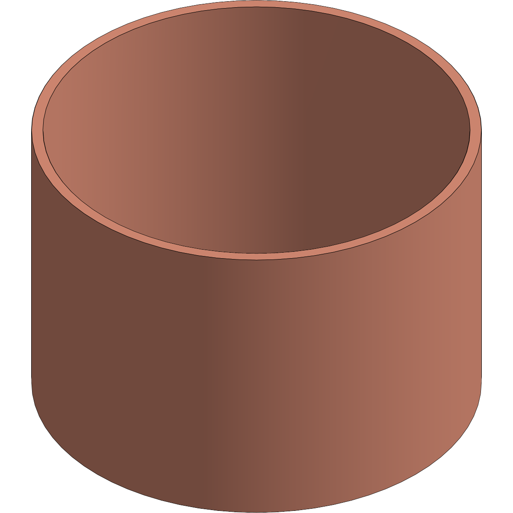

---

## Printing

All structural parts are PETG on the Bambu A1 mini. Filament has to be dried or you get moisture bubbles that become stress risers at speed. Not optional.

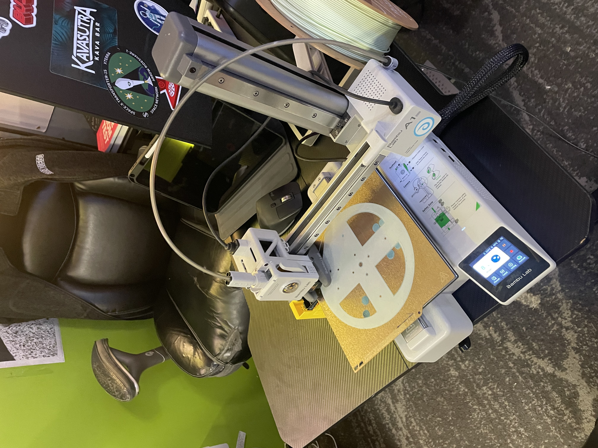

Opposing rotor arms are printed in the same job so they shrink identically. Matched sets, not mix and match.

---

## The parts

What I already have:

| Part | Notes |
|---|---|
| A2212 brushless motor (1000 KV, 5 mm shaft) | Ramp tested, ran clean |
| 30A sensorless ESC | Brake disabled, smooth ramp |
| Raspberry Pi Pico | MicroPython |
| 2S LiPo (~7.4V) | Needs a fuse and physical disconnect |
| Bambu A1 mini | PETG, dried filament |

What I still need:

| Part | Notes |
|---|---|
| 8 mm ground steel rod | ~100-125 mm |
| 5-to-8 mm rigid coupler | Buy, do not print |
| Bearings (size TBD) | Real bearings only |
| M4 × 6 screws | Assembly hardware |
| IR reflective sensor | Tachometer, 4-8 mm gap |
| MPU-6050 | Imbalance detection |
| 15 mL conical tubes (×4) | Opposing tubes matched to ±0.1 g |
| Containment vessel + lid | Measuring rotor tip radius first |
| Glycerol + dye | Validation run before any blood |

Printed parts (PETG, dried, matched sets in one print job):

| Part | Onshape name |
|---|---|
| Base | Base |
| Base Cover | Base Cover |
| Bearing Holder | Bearing Holder |
| Top | Top |
| Rotor | Rotor |

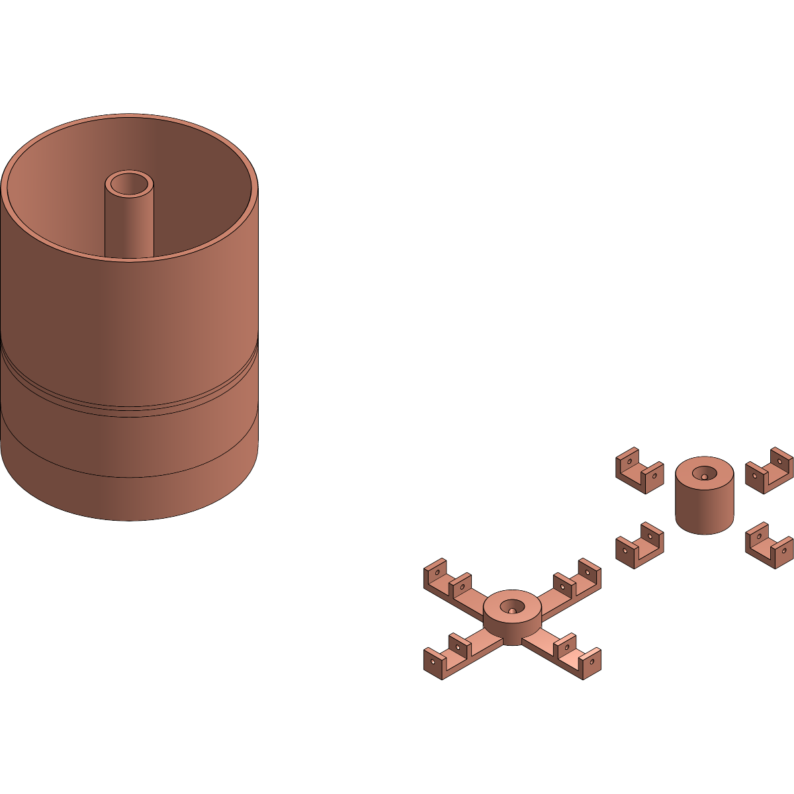

---

## Validation plan

No blood until all of these pass, in order:

- Fastener retention after 10 minutes unloaded
- Rotor runs true, no visible wobble at setpoint
- Empty balance, then loaded balance at ±0.1 g on opposing tubes
- MPU-6050 shutdown triggers on a deliberate imbalance
- Guarded overspeed test with the lid closed
- **The real test**: dyed water over glycerol, setpoint RPM, 30 minutes, coast over 2 minutes

Last one is the real test. Clean interface = the device holds enough g-force long enough to separate by density. Smeared or no interface = fail.

Only after that does it get real blood.

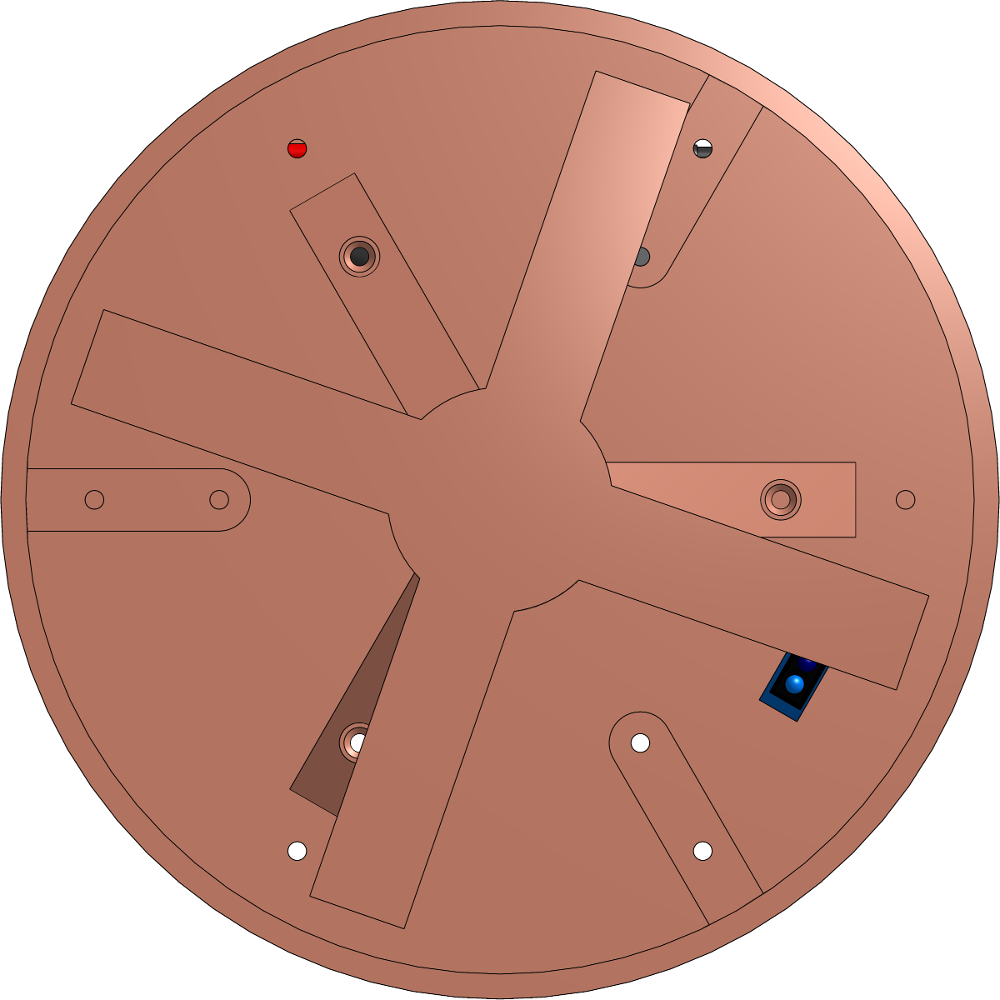

---

## Why build this in public

A used lab centrifuge would've been easier. I looked at OpenFuge and the other 3D-printed centrifuge designs. Most can't fit 15 mL conical tubes, which is what you need for PBMC washing steps.

If this works, it drops the cost of blood processing from $800-$3,000 to about $50 in parts. Every piece of cancer research infrastructure that can be open-sourced and made cheap should be.

The Bloom pipeline is already open source. The computational prediction is free. If the wet lab validation can also be done with printed parts and a Pico, then the barrier to testing a neoantigen candidate goes from "you need a lab" to "you need a bench and some patience."

---

## What's next

Coupler and bearings are on order. Once they arrive, I print the parts and start the validation sequence. I'll document every step in this repo.

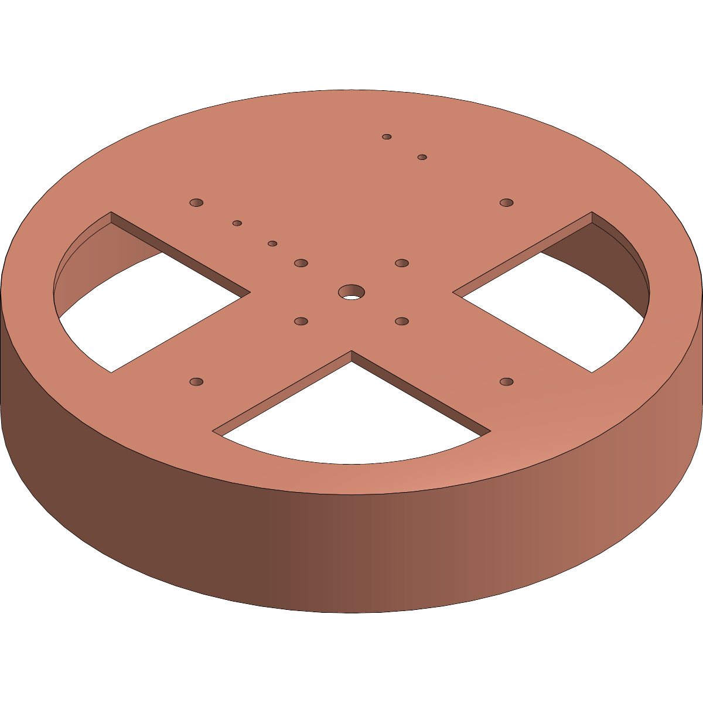

**CAD files**: public on Onshape - [ComfyBloom Centrifuge Assembly](https://cad.onshape.com/documents/7f68ca2c53fefee57657ef1a/w/1be7287435b32af101e9f2c0/e/be93f421865ffb81668b9cbd)

**Code**: will go in this repo as the firmware matures past the ramp test

**BOM, build log, and voice notes**: all in the repo at [github.com/ThomasVuNguyen/picocentrifuge](https://github.com/ThomasVuNguyen/picocentrifuge)

If you're building something similar, or if you're working on cancer immunotherapy validation and the cost of equipment is stopping you, reach out. This should not be a solo effort.

---

## Source code, useful links & sponsors

- [Onshape CAD (view-only)](https://cad.onshape.com/documents/7f68ca2c53fefee57657ef1a/w/1be7287435b32af101e9f2c0/e/be93f421865ffb81668b9cbd)
- [GitHub repo](https://github.com/ThomasVuNguyen/picocentrifuge)
- [Bloom pipeline](https://github.com/ThomasVuNguyen/comfybloom)

---

With intelligence and enthusiasm, anything is possible